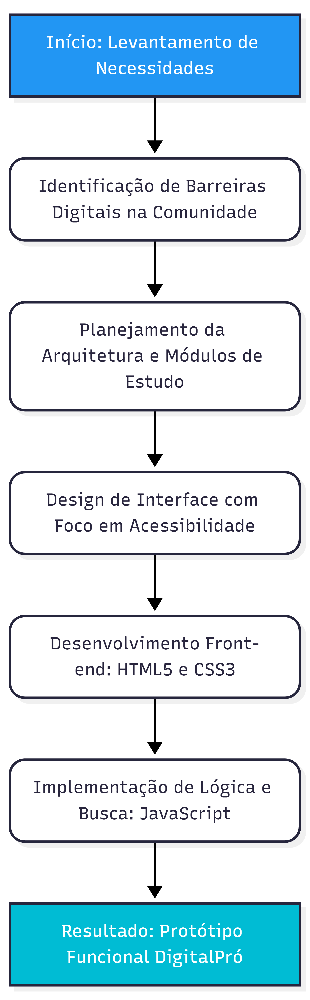

# � DigitalPró - Alfabetização Digital Acessível

> **Projeto de Atividade Extensionista I**  
> **Curso:** CST em Análise e Desenvolvimento de Sistemas  
> **Instituição:** Centro Universitário Internacional UNINTER  
> **Estudante:** João Pedro de Melo Chaves Silva (RU: 4335743)


---

## � Demonstração Online
Acesse o projeto funcionando clicando no link abaixo:
### <a href="https://joao2133.github.io/extensionista1-ADS/" target="_blank">🌐 CLIQUE AQUI PARA ACESSAR O SITE</a>

---

## 📖 Sobre o Projeto
O **DigitalPró** é uma plataforma educacional desenvolvida como parte da disciplina de **Tecnologia Aplicada à Inclusão Digital**. 

### 🎯 Objetivo
O objetivo central é democratizar o acesso ao conhecimento tecnológico para pessoas com pouco ou nenhum contato prévio com dispositivos digitais (como idosos e comunidades carentes). O projeto foca em reduzir o "abismo digital", promovendo autonomia e segurança na navegação básica da internet através de conteúdos focados nos ODS 4 (Educação de Qualidade) e ODS 10 (Redução de Desigualdades).

### 📚 Conteúdo Agregado
A plataforma organiza cursos gratuitos da plataforma:
*   **Curso em Vídeo** 

---

## � Metodologia e Estrutura

Para garantir a organização do projeto, a estrutura de navegação foi projetada para ser intuitiva e direta:

### 1. Mapa do Site
Abaixo, a representação visual de como as páginas estão interconectadas:



### 2. Organização de Arquivos
*   `index.html`: Portal de entrada e apresentação.
*   `subpags/cursos.html`: Catálogo com filtros inteligentes e busca.
*   `subpags/ajuda.html`: Central de suporte ao usuário.
*   `style.css`: Estilização global moderna e responsiva.

---

## �️ Tecnologias Utilizadas

O projeto foi construído focando em leveza e acessibilidade universal:

*   **HTML5 Semântico:** Melhor estrutura para leitores de tela e SEO.
*   **CSS3 Moderno:**
    *   **Layout Responsivo:** Mobile-first para funcionar em aparelhos antigos e modernos.
    *   **Design System:** Cores contrastantes e tipografia (Poppins) focada em legibilidade.
*   **JavaScript (Vanilla):** Sistema de busca e filtragem dinâmica de cursos em tempo real.
*   **Git & GitHub Pages:** Versionamento e hospedagem.

---

## 🚀 Como executar localmente

Caso queira rodar o projeto na sua máquina:

1. **Clone o repositório:**
   ```bash
   git clone https://github.com/joao2133/extensionista1-ADS.git
   ```
2. **Abra o arquivo:**
   Basta abrir o `index.html` em seu navegador de preferência.

---
*Este projeto foi desenvolvido com fins exclusivamente educacionais para a disciplina de Atividades Extensionistas.*
